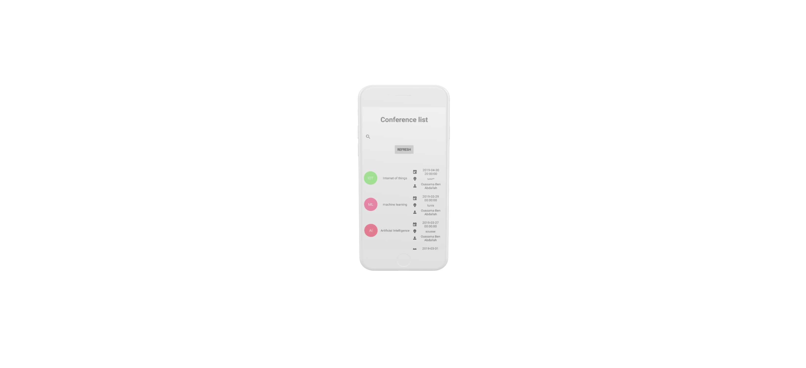

# ENSIT 

 

# Projet fin d'année 2019
## 2éme année Génie Informatique  
### Oussama Ben Abdallah -- Firas Tayeb
### _Encadrant: Dr.Ramzi Farhat_
#### Développement d'une Application mobile pour le suivi des conférences.

                    